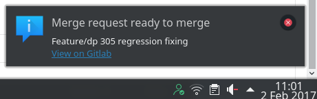
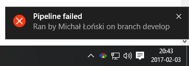

# Gitlab monitor

Monitors gitlab project and show system notifications when an event occurs. Running on Windows and Linux.




## Installation

### 1. Ruby interpreter

Install ruby interpreter. For linux use [RVM](https://rvm.io/), for windows [RubyInstaller](https://rubyinstaller.org/).

### 2. Bundler

Make sure you have bundler gem installed:

```sh
gem install bundler
```

### 3. Dependencies installation

Enter gitlab_notify/app directory and install dependencies:

*Linux:* 
```sh
bundle install --without windows
```

*Windows:*
```sh
bundle install --without linux
```

### 4. Running Gitlab Monitor

To manualy run gitlab monitor:

```sh
bundle exec ruby gitlab_monitor.rb
```

## Running systemd service (Linux only)

Copy service file to user services directory:

```sh
cp systemd-service/gitlab_monitor.service ~/.config/systemd/user
```

Replace `GITLAB_MONITOR_DIR` with gitlab_monitor location:

```sh
sed -i -- 's?GITLAB_MONITOR_DIR?'`pwd`'?g' ~/.config/systemd/user/gitlab_monitor.service
```

Enable service:

```sh
systemctl --user enable gitlab_monitor
```

## Autostarting on windows

There are two starters prepared in 'windows-starter' directory:

1. `windows-starter/gitlab_monitor.bat` - runs app in command line window
2. `windows-starter/start_in_backgroud.vbs` - runs above batch file in the background

To add it to windows autostart create a shortcut of `start_in_background.vbs` file, and move it to startup folder. Startup folder can be opened by running `shell:startup` in windows 'run' window. In general it is located in `C:\Users\<username>\AppData\Roaming\Microsoft\Windows\Start Menu\Programs\Startup`.

## Configuration

Edit file `app/configuration.rb`

* To run on Linux use `LinuxNotificationExecutor` as implementation of `NOTIFIER`
* To run on Windows use `WindowsNotificationExecutor` as implementation of `NOTIFIER`
